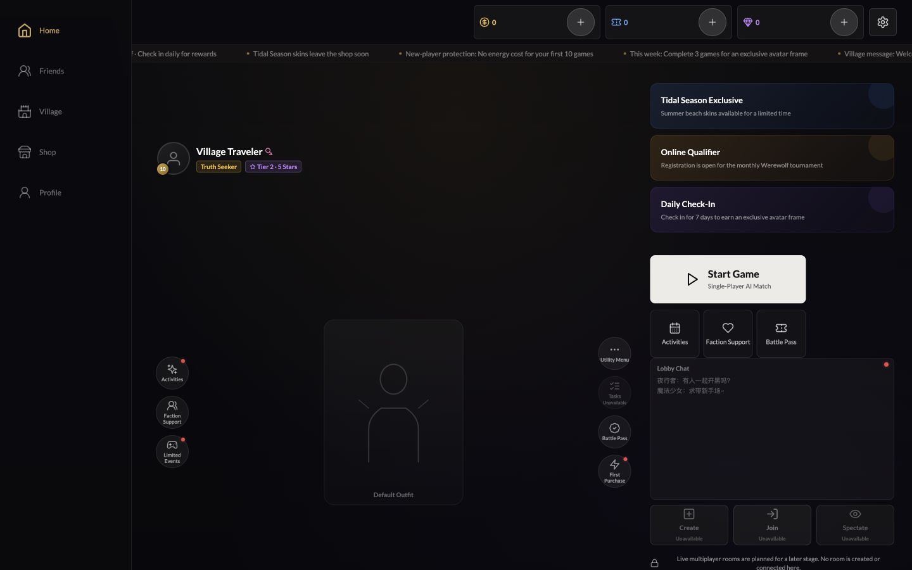
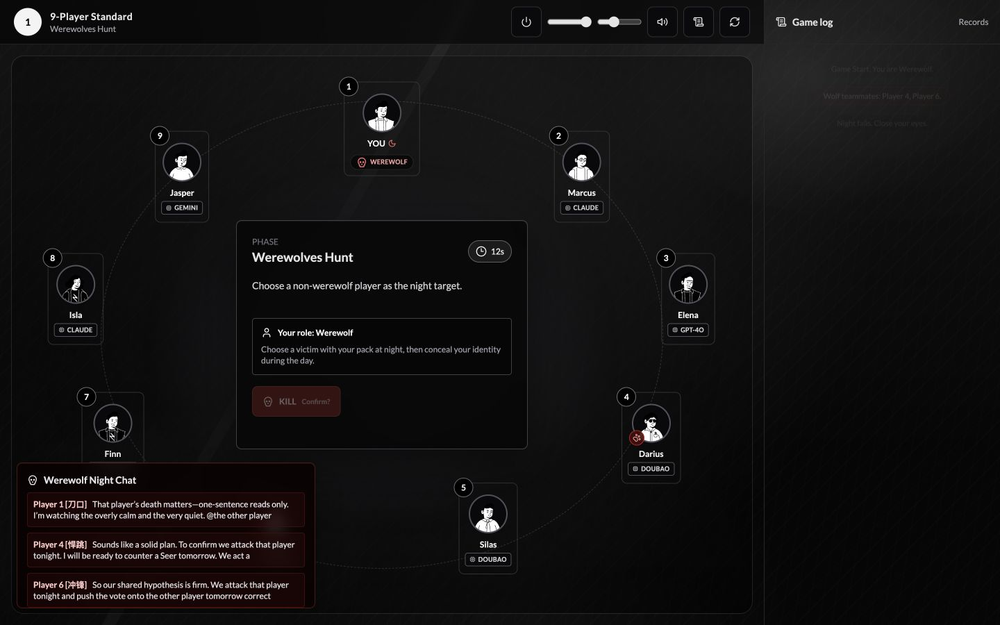
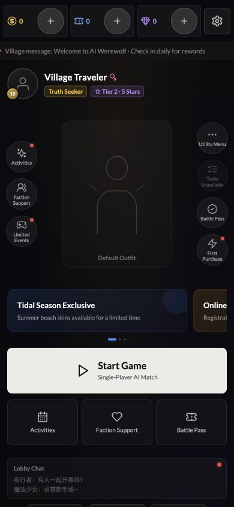
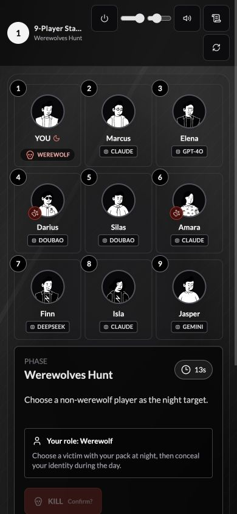
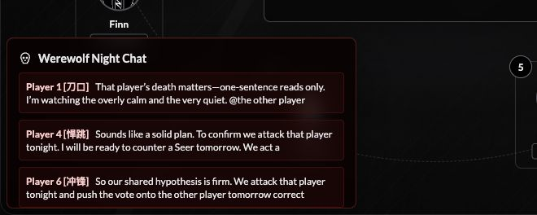

# AI Werewolf

AI Werewolf is a browser-based social deduction game where one human player faces strategic AI agents in complete, rules-driven Werewolf matches.

[](https://github.com/xuxuduoduo616/aiwerewolf/actions/workflows/deploy.yml)
[](https://react.dev/)
[](https://www.typescriptlang.org/)

**Live demo:** [ai-werewolf.net](https://ai-werewolf.net)

The project separates game rules from generated expression. A deterministic rules engine and belief/action layer decide what agents know and do; the language layer turns those decisions into characterful dialogue and falls back to a bundled speech library when the external AI provider is unavailable.

## Features

- Complete single-player matches against AI-controlled players
- 9-player and 12-player boards with Villager, Werewolf, Seer, Witch, Hunter, and Idiot roles
- Three difficulty levels and role-specific AI behavior profiles
- Belief tracking, strategic action selection, wolf-team coordination, voting, last words, and win resolution
- Per-match dialogue refinement with Gemini by default and capability-gated GPT-5.5 / GPT-5.6 Luna choices
- Email OTP authentication, guest trial, local guest records, and player statistics
- Responsive desktop, tablet, and mobile layouts with keyboard and safe-area support
- English application interface with source-authored player and AI dialogue preserved
- Production hosting on Netlify with build verification through GitHub Actions

Multiplayer rooms, premium purchases, real rewards, and live payment processing are intentionally unavailable. Their visible UI is a roadmap preview and does not create rooms, charge users, or grant assets.

## Screenshots

### Lobby



### Gameplay



| Mobile lobby | Mobile gameplay |
| --- | --- |
|  |  |

### AI Conversation



## Technology Stack

| Area | Technology |
| --- | --- |
| Frontend | React 18, TypeScript, Vite, Tailwind CSS |
| Game and AI logic | TypeScript rules engine, belief tracker, action selector, local speech library |
| AI provider | Gemini 2.5 Flash by default; capability-gated GPT-5.5 and GPT-5.6 Luna through direct OpenAI or Vercel AI Gateway, with local fallback |
| Authentication and data | Supabase Auth and Postgres |
| Hosting | Netlify CDN and Functions |
| Continuous integration | GitHub Actions production-build verification |
| Testing | Vitest |

## Current Development Status

| Feature | Status |
| --- | --- |
| Core 9-player and 12-player gameplay | Complete |
| AI decision and dialogue pipeline | Complete |
| Responsive desktop/mobile interface | Complete |
| English application interface | Complete |
| Guest trial and email OTP integration | Complete |
| Player profile and game-record integration | Complete; production data policy verification remains owner-operated |
| Social lobby surfaces | Preview only |
| Real-player multiplayer | Planned |
| Payment processing | Disabled; provider integration not configured |
| Cloud text-to-speech | Planned |

## Architecture

```text
React interface
  |-- game state hook --------------------+
  |                                       |
  +--> deterministic game engine          |
  +--> belief tracker + action selector   |-- complete match state
  +--> speech library + selected model ---+

Browser --> Netlify CDN / Functions --> Gemini, OpenAI API, or Vercel AI Gateway
   |
   +--> Supabase Auth / Postgres
```

The browser can run a full match without an AI API key. Gemini is the default expression model. GPT-5.5 and GPT-5.6 Luna appear together only after the server atomically verifies both exact direct OpenAI IDs or both exact Vercel AI Gateway slugs. Each user request makes at most one GPT generation POST; a selected upstream failure goes to Gemini/local fallback instead of retrying through the other GPT upstream. A later read-only capability refresh may change the selected GPT upstream. Model choice affects dialogue and wolf chat, never deterministic rules or action selection. Provider keys and Supabase service-role credentials must never be exposed to the frontend. See [Architecture](docs/architecture.md) for module boundaries and security constraints.

## Local Development

Prerequisites: Node.js 20 and npm.

```bash
git clone https://github.com/xuxuduoduo616/aiwerewolf.git
cd aiwerewolf
npm install
npm run dev
```

The Vite development server uses local fallback dialogue. To exercise Netlify Functions locally, install or use the included Netlify CLI and run `npx netlify dev` after configuring the required environment variables.

```bash
npm run test:run
npm run build
```

Copy `.env.example` to `.env.local` for local configuration. Never commit `.env.local` or server credentials.

| Variable | Purpose |
| --- | --- |
| `API_KEY` | Server-side Gemini access |
| `OPENAI_API_KEY` | Optional server-side OpenAI access; never prefix with `VITE_` |
| `AI_GATEWAY_API_KEY` | Optional server-side Vercel AI Gateway access; never prefix with `VITE_` |
| `VITE_SUPABASE_URL` | Public Supabase project URL |
| `VITE_SUPABASE_ANON_KEY` | Public Supabase anonymous key |
| `VITE_TURNSTILE_SITE_KEY` | Public Cloudflare Turnstile site key required by production builds |
| `SUPABASE_SERVICE_ROLE_KEY` | Server-only Supabase administration; never expose to the browser |
| `ALLOWED_ORIGIN` | Production CORS allowlist |

More detail is available in [Development](docs/development.md) and [Supabase setup](docs/supabase-setup.md).

## Roadmap

- **v1.0 - Playable AI Werewolf:** two boards, full role resolution, AI strategy, responsive UI, authentication, and production deployment
- **v1.1 - AI quality:** resolve remaining dialogue placeholders, improve language consistency, and evaluate cloud text-to-speech
- **v1.2 - Social foundation:** profiles, friend relationships, messaging, presence, moderation boundaries, and verified row-level security
- **v2.0 - Server-authoritative multiplayer:** private rooms, invitations, reconnect support, secret-state projection, and idempotent game commands

See [Roadmap](docs/roadmap.md) for scope and release gates. Planned work is not presented as an available feature.

## Contributing

Bug reports and focused improvements are welcome. Please read [CONTRIBUTING.md](CONTRIBUTING.md) before opening an issue or pull request. Security concerns should follow [SECURITY.md](SECURITY.md) rather than a public issue.

## License and Data Notice

This repository is currently source-available under the terms in [LICENSE](LICENSE); it is not yet released under an OSI-approved open-source license.

The provenance and redistribution rights of the bundled role-specific speech corpus are still being reviewed. Do not redistribute or reuse corpus files independently. A permissive software license will be considered only after those rights are resolved or the corpus is replaced.
